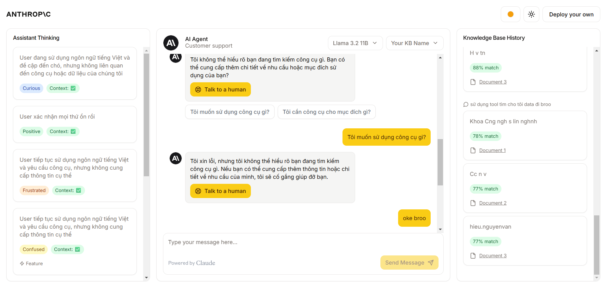

# Groq Customer Support Agent

An advanced, fully customizable customer support chat interface powered by Groq, with local storage using Faiss through LangChain.

## Key Features

-  AI-powered chat using Groq's LLM models
-  Amazon Bedrock integration for contextual knowledge retrieval 
-  Local vector storage using Faiss and LangChain
-  Real-time thinking & debug information display
-  Knowledge base source visualization
-  User mood detection & appropriate agent redirection
-  Highly customizable UI with shadcn/ui components

##  Getting Started

1. Clone this repository
2. Install dependencies: `npm install`
3. Set up your environment variables (see Configuration section)
4. Run the development server: `npm run dev`
5. Open [http://localhost:3000](http://localhost:3000) in your browser

## ⚙️ Configuration

Create a `.env.local` file in the root directory with the following variables:
